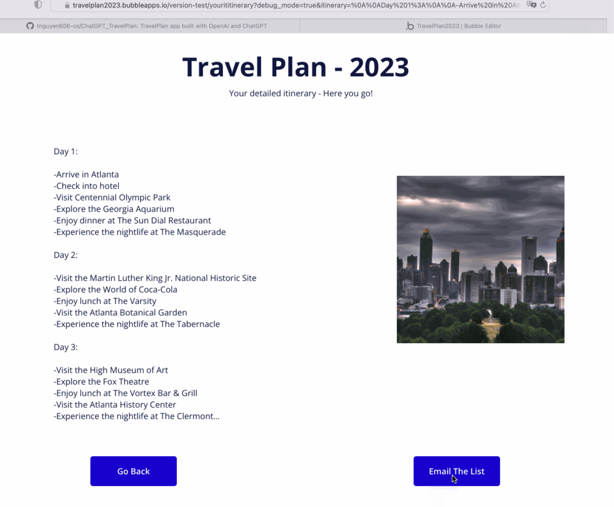

# ChatGPT - TravelPlan

## Description:

* `TravelPlan` enables users to create detailed itineraries after specifying a location they are traveling, how long they are going for, and what they want to do based on location, trip length, and interests.

* Built full enterprise solutions and real-life web application with `OpenAI` and `ChatGPT`. ChatGPT is adapted from OpenAI’s `GPT-3.5` model. 

***Why we need to learn how to integrate ChatGPT into your solutions and applications?***

Imagine how easy it would be for ChatGPT to create a first draft on your travel itinerary to Atlanta or anywhere.

## How does ChatGPT work?

* There are two parts: 

### 1. Trainning

- `Pre-traning` stage: We train `GPT model` in such a way that it learns patterns, common words and phrases are typically used from the open internet. `AI chatbot ChatGPT` has been trained to provide conversational answers to users’ queries.

- `Fine-tuning` stage: Once `GPT model` has been `pre-trained`, it enters into a `question-answering ChatGPT model` such as answering questions or generating approriate responses to prompts. Based on task-specific data, it allows the model to tailor its language generation capabilities to the specific needs of the chatbot, respectively. `Fine-tuning` lets you get more out of the models available through the API. Fine-tuning is currently only available for the following base models: `davinci`, `curie`, `babbage`, and `ada`. In this project, we only use training: `text-davinci-003`. 

### 2. Answer a prompt from the Chat

- Step 1: the user enters an input words (e.g, "Give me an icon of AI", "Who is Leonardo da Vinci") 
- Step 2: the input is sent to a content moderation component. This component ensures whether content complies with OpenAI's content policy.
- Steps 3-4: If the input passes content moderation, it is sent to the chatGPT model. If the input doesn’t pass content moderation, it goes straight to template response generation.
- Step 5-6: Once the model generates the response, it is sent to a content moderation component again. This ensures the generated response is safe, harmless, unbiased, etc.
- Step 7: If the input passes content moderation, it is shown to the user. If the input doesn’t pass content moderation, it goes to template response generation and shows a template answer to the user.

* [Learn more](https://platform.openai.com/docs/guides/completion/introduction)

## Environment setup

1. [Sign up OpenAI account](https://beta.openai.com/overview)
2. [Create Azure function account: Azure function helps to manage a whole application system](https://portal.azure.com/?quickstart=true#home)
3. [Postman to test APIs](https://web.postman.co/workspace/My-Workspace~93480ba9-8acf-4ff3-87c3-10ccda3760d8/overview?workspaceOnboarding=show)
4. [Power Automate to serve as a back-end scene](https://make.powerautomate.com/environments)

## Create a serverless wrapper API with ChatGPT

* Connect to `OpenAI API` and create an `Azure function` that leverages ChatGPT using OpenAI and deploy Azure functions

> [How to deploy a serverless app in Azure Function](https://marketplace.visualstudio.com/items?itemName=ms-azuretools.vscode-azurefunctions)

## Set-up the front-end with [Bubble](https://bubble.io/)

## Video Walkthrough

* Enter input values to generate the prompt as example below:

* ChatGPT responses to the prompt's inputs:

* Send the plan to email option:

* GIF created with **LiceCap**

## License

    Copyright 2023 Tam Nguyen

    Licensed under the Apache License, Version 2.0 (the "License");
    you may not use this file except in compliance with the License.
    You may obtain a copy of the License at

        http://www.apache.org/licenses/LICENSE-2.0

    Unless required by applicable law or agreed to in writing, software
    distributed under the License is distributed on an "AS IS" BASIS,
    WITHOUT WARRANTIES OR CONDITIONS OF ANY KIND, either express or implied.
    See the License for the specific language governing permissions and
    limitations under the License.

