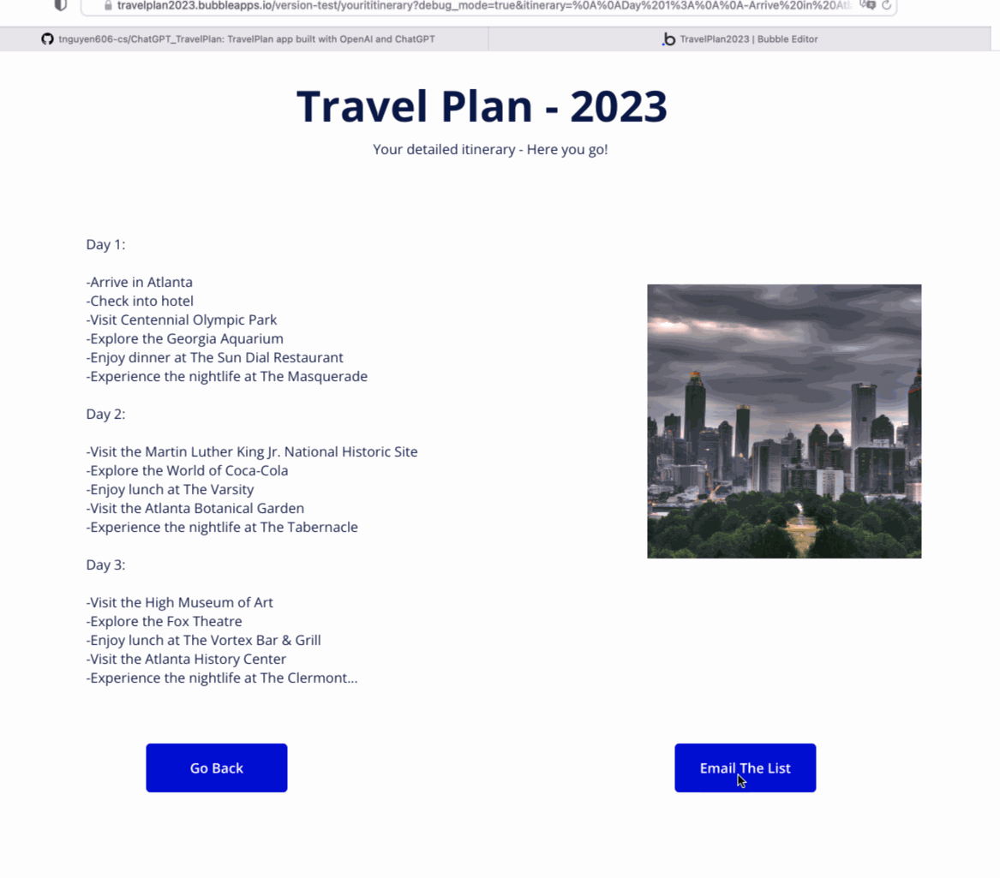

# ChatGPT - TravelPlan

## Description:

* `TravelPlan` enables users to create detailed itineraries after specifying a location they are traveling, how long they are going for, and what they want to do based on location, trip length, and interests.

* Built full enterprise solutions and real-life web application with `OpenAI` and `ChatGPT`.

## Why learn how to integrate ChatGPT into your solutions and applications

* Improve your productivity* - imagine how easy it would be for ChatGPT to create a first draft on your travel itinerary to Atlanta or anywhere. 

## Environment setup

1. [Sign up OpenAI account](https://beta.openai.com/overview)
2. [Create Azure function account: Azure function helps to manage a whole application system](https://portal.azure.com/?quickstart=true#home)
3. [Postman to test APIs](https://web.postman.co/workspace/My-Workspace~93480ba9-8acf-4ff3-87c3-10ccda3760d8/overview?workspaceOnboarding=show)
4. [Power Automate to serve as a back-end scene](https://make.powerautomate.com/environments)

## Create a serverless wrapper API with ChatGPT

* Connect to `OpenAI API` and create an `Azure function` that leverages ChatGPT using OpenAI and deploy Azure functions

> [How to deploy a serverless app in Azure Function](https://marketplace.visualstudio.com/items?itemName=ms-azuretools.vscode-azurefunctions)

## Set-up the front-end with [Bubble](https://bubble.io/)

## Video Walkthrough

* Enter input values to generate the prompt as example below:

* ChatGPT responses to the prompt'input:

GIF created with **LiceCap**

## License

    Copyright 2023 Tam Nguyen

    Licensed under the Apache License, Version 2.0 (the "License");
    you may not use this file except in compliance with the License.
    You may obtain a copy of the License at

        http://www.apache.org/licenses/LICENSE-2.0

    Unless required by applicable law or agreed to in writing, software
    distributed under the License is distributed on an "AS IS" BASIS,
    WITHOUT WARRANTIES OR CONDITIONS OF ANY KIND, either express or implied.
    See the License for the specific language governing permissions and
    limitations under the License.

